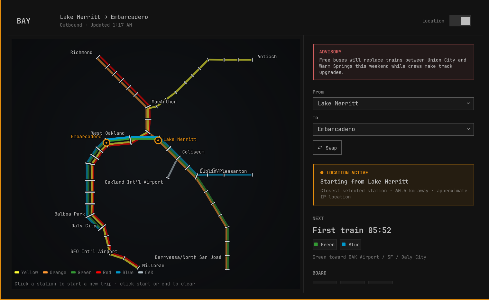
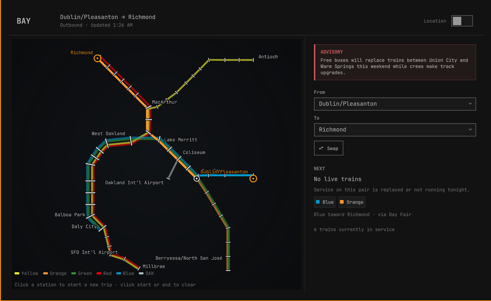

# Bay Transit Board

An unofficial Omarchy bar plugin for planning trips and viewing live departures on the San Francisco Bay Area rapid-transit network. It uses the [BART Developer Program](https://www.bart.gov/about/developers) feeds and requires no API key.

Bay Transit Board is an independent project. It is not affiliated with, endorsed by, or an official application of the San Francisco Bay Area Rapid Transit District. It does not use the official BART logo or system map.

## Screenshots

### Direct route, parallel services, and Location



### Suggested one-transfer route



## Features

- Click or search for a start and end station.
- See direct services or a suggested one-transfer route.
- View scheduled trains, live departure estimates, and service advisories.
- Explore an original schematic map drawn by the plugin in QML.
- Optionally use an approximate IP location to start from the closer selected station.

Middle-click the bar, or press `X`, to swap stations. Press `R` to refresh and `L` to toggle Location.

## Requirements

- Omarchy with the current Omarchy Shell/Quickshell plugin system
- Python 3.9 or newer with the standard library
- Internet access to retrieve transit feeds

No Python packages, API keys, privileged commands, background services, or installer scripts are required.

## Install

```sh
omarchy plugin add https://github.com/adg-ub/omarchy-bay-transit-board.git --enable
```

The widget is placed in the center section of the bar by default.

## Configure

The panel can configure the trip interactively. The same settings and actions are available from the command line:

```sh
omarchy bar set io.github.adg-ub.bay-transit-board origin EMBR
omarchy bar set io.github.adg-ub.bay-transit-board dest RICH
omarchy-shell io.github.adg-ub.bay-transit-board swap
omarchy-shell io.github.adg-ub.bay-transit-board status
```

## Update

```sh
omarchy plugin update io.github.adg-ub.bay-transit-board
```

## Remove

```sh
omarchy plugin remove io.github.adg-ub.bay-transit-board
```

Removal leaves the downloaded transit-data cache in place. Delete that cache only if you no longer want it:

```sh
rm -rf "$HOME/.local/state/omarchy/bay-transit-board"
```

## Network access and privacy

The plugin has no analytics or telemetry. Your selected stations and settings are processed locally and are not sent to ipinfo.io.

The following network requests are made:

| Service | When | Data sent or exposed |
| --- | --- | --- |
| `www.bart.gov` and `api.bart.gov` | During refreshes | Standard HTTPS request metadata, including your public IP address |
| `ipinfo.io/json` | Only when Location is enabled | Your public IP address as part of the HTTPS connection |

When Location is enabled, ipinfo.io returns an approximate city and latitude/longitude for the public IP. The plugin uses those coordinates locally to choose which of the two selected stations is closer. Location is approximate and may be inaccurate, especially on VPNs, mobile networks, or shared connections.

The origin station, destination station, and Location toggle are stored in your local Omarchy Shell configuration. Downloaded GTFS data and a non-executable JSON cache are stored under `~/.local/state/omarchy/bay-transit-board/`. Approximate location coordinates are not written to the plugin cache.

## Transit data

| Feed | Used for |
| --- | --- |
| [GTFS schedule](https://www.bart.gov/dev/schedules/google_transit.zip) | Stations, routes, service pairs, and scheduled times |
| [GTFS-RT TripUpdates](https://api.bart.gov/gtfsrt/tripupdate.aspx) | Real-time departure estimates |
| [GTFS-RT Alerts](https://api.bart.gov/gtfsrt/alerts.aspx) | Service advisories |
| [Advisories RSS](https://www.bart.gov/schedules/advisories/advisories.xml) | Advisory fallback |

The GTFS schedule is cached for up to 12 hours. If a refresh fails, a previously validated schedule may be used for up to seven days and the response reports that it is stale. Real-time data is retrieved during each refresh.

All provider URLs require HTTPS. Redirects are limited to the same origin, and one whole-request deadline covers DNS lookup, connection setup, TLS, redirects, and body reads. Every network response has an explicit byte limit.

Before parsing, GTFS archives are checked for compressed size, entry count, paths, encryption, per-entry and total expanded size, compression ratio, CSV field size, row count, field length, and derived-record count. Invalid feeds are rejected without replacing the last valid archive.

The cache directory is opened component-by-component without following symlinks, restricted to the current user, and retained through descriptor-relative file operations. Cache and archive updates use unpredictable, exclusively created temporary files and atomic replacement. Cached files are bounded regular files owned by the current user, and the JSON cache is tied to the archive by SHA-256.

Realtime entities, nested protobuf fields, alert strings, matching trips, displayed lines, departures, and final JSON output are also bounded before data reaches QML.

## Development

Run the standard-library test suite with:

```sh
python3 -m unittest discover -s tests -v
omarchy plugin validate .
```

With `qmllint` installed, validate the QML against the active Omarchy shell:

```sh
qmllint -I "$OMARCHY_PATH/shell" \
  BarWidget.qml Panel.qml NetworkMap.qml AlertCard.qml DestinationRow.qml
```

The Python tests cover network, archive, cache, filesystem, protobuf, routing, derived-cardinality, and serialized-output boundaries.

## License

Plugin source code is licensed under the [MIT License](LICENSE). Transit data is owned by the San Francisco Bay Area Rapid Transit District and is used under its [Developer License Agreement](https://www.bart.gov/schedules/developers/developer-license-agreement). See [THIRD_PARTY_NOTICES.md](THIRD_PARTY_NOTICES.md).
